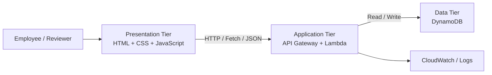

# Target Three-Tier Architecture

The architecture describes **where responsibilities belong**.

The Week 4 implementation only builds the browser interface, but the project is designed toward the full target architecture.

---

## Target Architecture



---

## Presentation Tier

### Purpose
Interact with the user.

### Responsibilities

- Display the page
- Collect input
- Provide immediate feedback
- Improve accessibility/usability
- Later call the API using Fetch/JSON
- Later display server responses

### Not authoritative for

- final authorization,
- official state transitions,
- trusted transaction IDs,
- trusted audit timestamps,
- permanent storage.

---

## Application Tier

### Purpose
Make trusted transaction decisions.

### Future responsibilities

- Authoritative validation
- Business-rule enforcement
- Authorization
- Generate official transaction IDs
- Determine required approval path
- Validate state transitions
- Create trusted timestamps/audit events
- Coordinate reads/writes with the data tier
- Return controlled API responses

---

## Data Tier

### Purpose
Persist the official record.

### Future responsibilities

Store:

- transaction ID,
- transaction business data,
- official status,
- timestamps,
- audit/history information.

The database should not become a substitute for all application logic.

---

## Week 4 Status

Implemented now:

```text
User → Browser HTML form
```

Designed but not implemented yet:

```text
Browser → API → Application Logic → Database
```

This keeps the architecture complete without pretending later course material has already been built.
