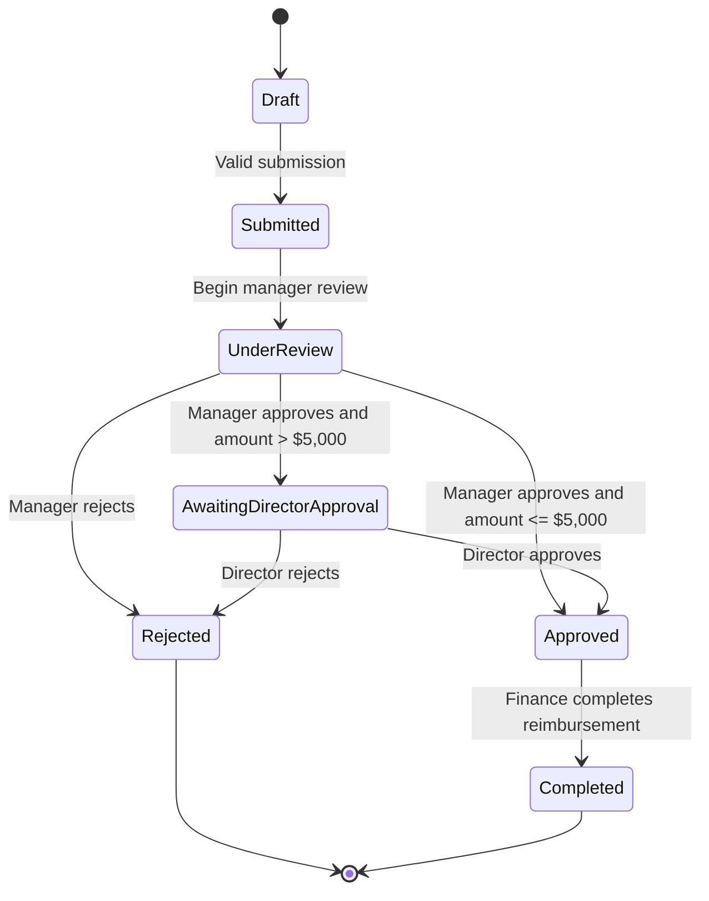

# Transaction State Model

A state describes a **persistent condition of the transaction**.

It answers:

> **What is true about this transaction now?**

---

## State Diagram



---

## State Definitions

| State | Meaning | Typical Entry Event | Valid Next State(s) |
|---|---|---|---|
| Draft | Request exists only as an editable preparation | Employee begins request | Submitted |
| Submitted | Valid request has become an official transaction | Employee submits valid request | UnderReview |
| UnderReview | Manager review is active | Review begins | Approved, AwaitingDirectorApproval, Rejected |
| AwaitingDirectorApproval | High-value request requires director decision | Manager approves request over $5,000 | Approved, Rejected |
| Approved | All required approvals are complete | Required reviewer approves | Completed |
| Completed | Reimbursement processing is finished | Finance completes processing | Terminal |
| Rejected | Request was denied | Manager or director rejects | Terminal |

---

## Important Design Rules

### Transaction ID is not a state

`EXP-2026-00418` identifies the transaction.

It should not change just because the status changes.

### Workflow action is not a state

“Manager reviews” is an action.

“Under Review” is the condition that can remain true while review is occurring.

### State transitions must be controlled

The browser should not be trusted to change official status freely.

Later, application logic will validate transitions such as:

```text
UnderReview → Approved
```

and reject invalid transitions such as:

```text
Completed → Draft
```

---

## State-to-Workflow Relationship

A useful design question is:

> What action or decision caused the transaction to move from one state to another?

Example:

```text
State before: UnderReview
Action: Manager approves
Condition: amount > $5,000
State after: AwaitingDirectorApproval
```
