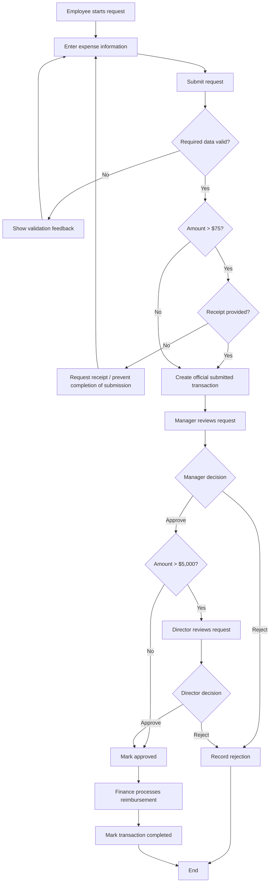

# Transaction Workflow
## Expense Reimbursement Request

Workflow models **actions, decisions, actors, and paths**.

It answers:

> **What happens next?**

---

## Main Workflow

---

## Workflow Explanation

### Employee submission

The employee enters the transaction data and attempts submission.

The system first determines whether submitted values are usable. A missing employee ID or non-positive amount is a validation problem.

### Receipt decision

If the amount is greater than `$75`, receipt evidence is required.

This is a conditional business rule. It is not appropriate to make the receipt universally required because low-value requests do not require one under this reference policy.

### Manager review

Every valid submitted request is routed to manager review.

The manager may:

- approve, or
- reject.

### High-value routing

After manager approval, the system checks the amount:

- `amount <= 5000` → no director approval under BR-03
- `amount > 5000` → director approval required

### Finance processing

Only fully approved requests proceed to reimbursement processing.

---

## Exception / Failure Examples

A complete workflow should show more than the happy path.

Important exception paths include:

- invalid input,
- required receipt missing,
- manager rejection,
- director rejection.

Later course weeks may add technical failure handling such as API/database errors.

---

## Workflow vs. State Reminder

Examples of workflow actions:

- Employee submits request
- Manager reviews request
- Director approves request
- Finance processes reimbursement

Examples of states:

- Submitted
- Under Review
- Awaiting Director Approval
- Approved
- Completed
- Rejected
